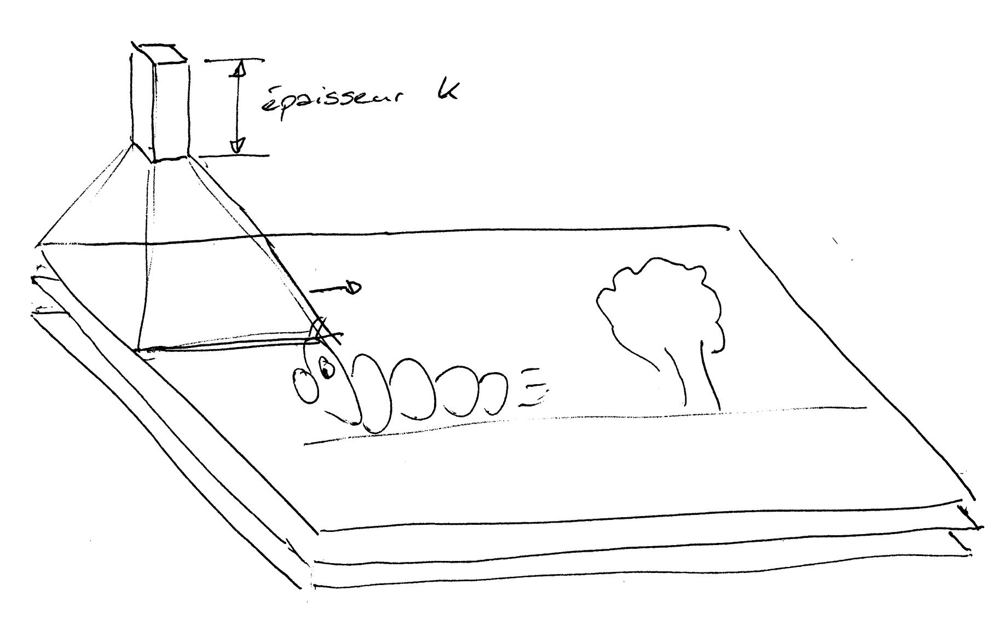
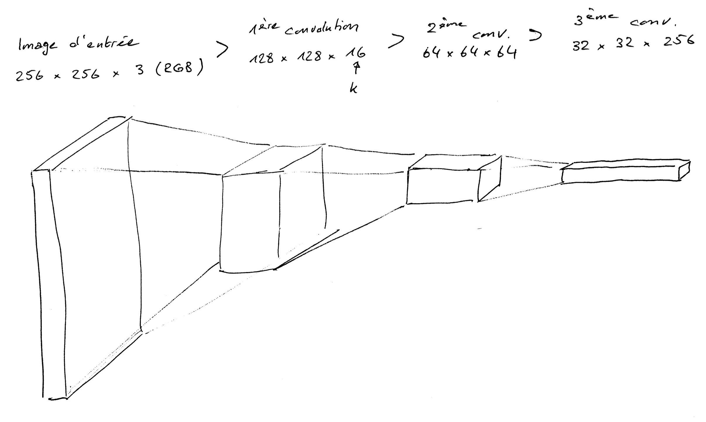

# Introduction aux Convolutional Neural Networks (CNN)

Convolutional Neural Networks, abbrégés CNN ou CovNets, sont des réseaux de neurons qui tiennent compte du voisinage dans l'espace d'entrée.

Dans l'exemple d'une image, un réseau de neurones classique ignore complètement si un pixel est localisé à côté d'un autre. Ainsi, chaque pixel est connecté à un neurone d'entrée, mais tous les neurones sont traités de la même manière, indépendamment de leur localisation les uns par rapport aux autres.

Dans un ConvNet, ce voisinage n'est plus ignoré. Concrètement, ceci est fait à travers des fenêtres flottantes (moving windows). L'image de départ (avec trois bandes: rouge, vert et bleu) est divisée en petites fenêtres, et pour chaque fenêtre, un réseau de neurones classique est calculé.

L'image ci-dessous montre l'exemple d'une image ainsi d'une fenêtre (un ***«patch»*** ou ***«kernel»***). Cette fenêtre, dont la taille doit être spécifiée dans les paramètres du réseau de neurones, est traitée comme l'input d'un réseau de neurones avec une certaines largeur, hauteur et une épaisseur $k$ (***depth***). Cette épaisseur $k$ est généralement beaucoup plus grande que celle de l'image d'entrée (pour une image en couleurs 3 bandes). Elle permet notamment de tenir compte de différents types de formes et d'objets dans l'image.

En raison de la taille plus limitée du patch en comparaison avec l'image totale, le nombre de poids à apprendre dans le réseau de neurones est moins important, et du coup la quantité de données nécessaires moindre.

Par la suite, ce réseau de neurones plus petit construit sur la base du premier patch est bougé à travers toute l'image, pas par pas. À chaque fois, la fenêtre est déplacée d'une distance à paramétrer, appelée le ***«stride»***. Ce qui est important est que les poids de ce réseau sont les mêmes pour chacun des patchs, donc partagés pour l'ensemble de l'image d'entrée.

Ce qui est intéressant dans ce genre d'approche est la possibilité de construire un «deep network» avec pluiseurs couches de convolutions l'une après l'autre. Ainsi, on obtient une sorte de pyramide avec la taille du réseau de neurones qui diminue étape par étape, et où l'épaisseur $k$ augmente en même temps:

Il est important à noter que l'épaisseur $k$ doit correspondre à peu près à la complexité sémantique de l'image d'entrée.

À la fin des convolutions, on peut ajouter des «couches normales» de réseau de neurones («fully connected layers»), et procéder à une classification.

 
 ## Ressources
 
 - Vidéo de Siraj sur les ConvNets: [https://www.youtube.com/watch?v=cAICT4Al5Ow](https://www.youtube.com/watch?v=cAICT4Al5Ow)

